# Concierge Backend — Flow Diagrams

## 1. End-to-End Request Lifecycle

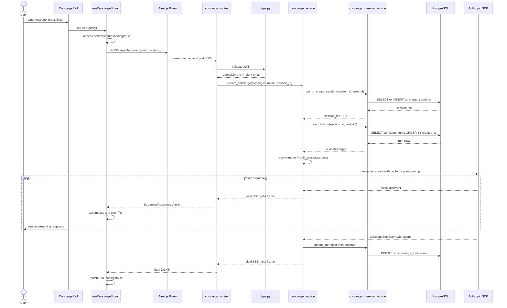

---

## 2. Backend Module Dependency Graph

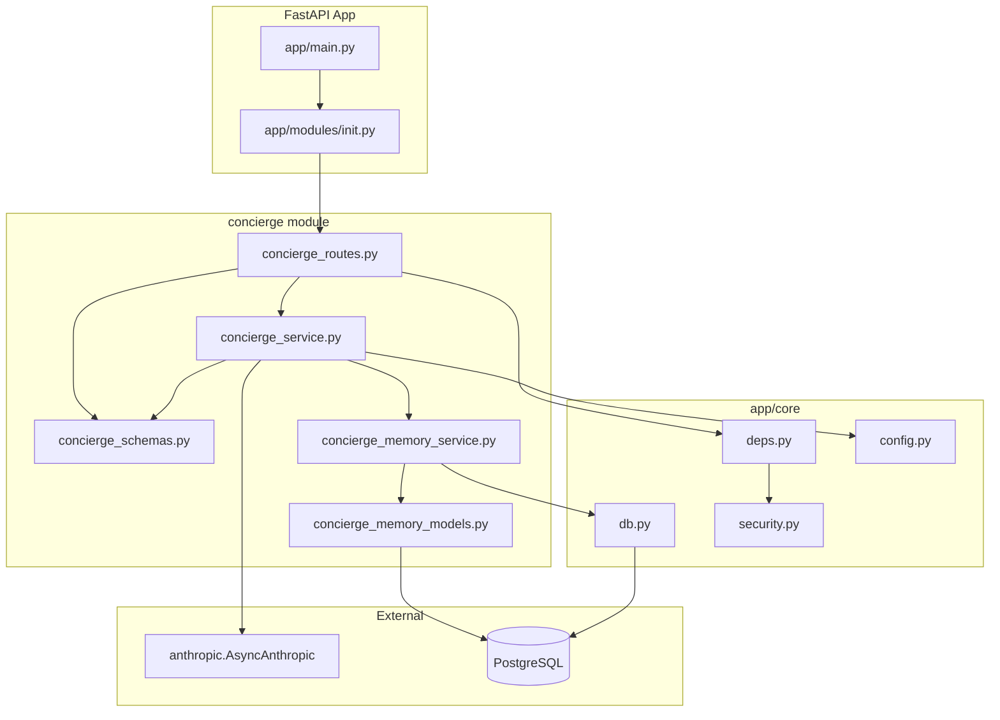

---

## 3. Memory Service Internal Flow

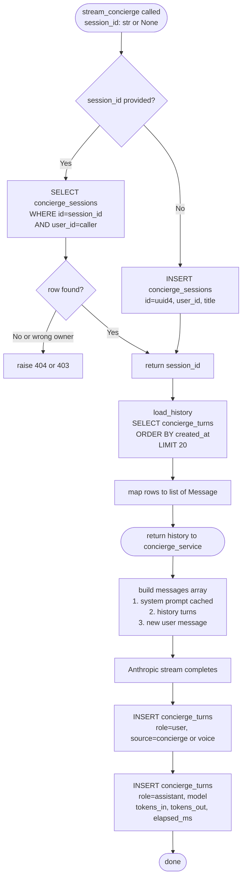

---

## 4. Anthropic SDK Streaming to SSE Chain

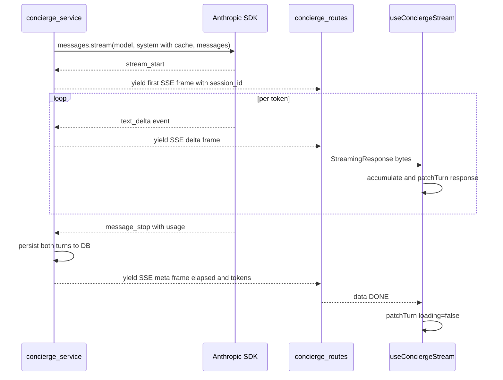

---

## 5. Frontend Component Tree

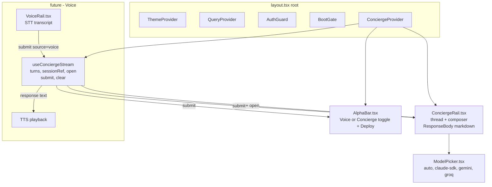

---

## 6. Prompt Caching Strategy

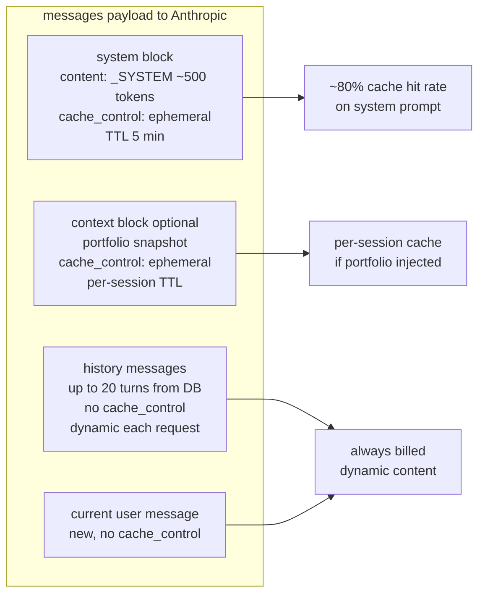

---

## 7. Model Routing Decision Tree

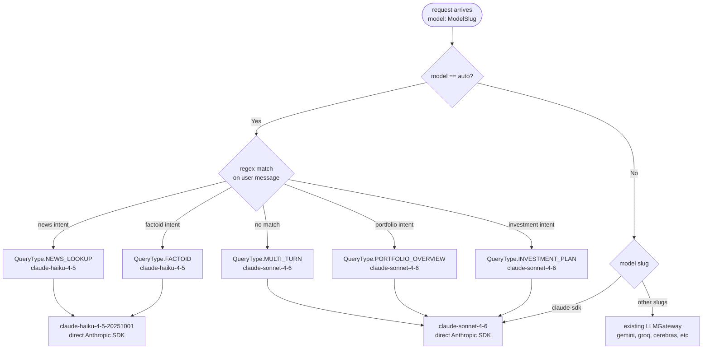

---

## 8. Voice + Concierge Shared Session

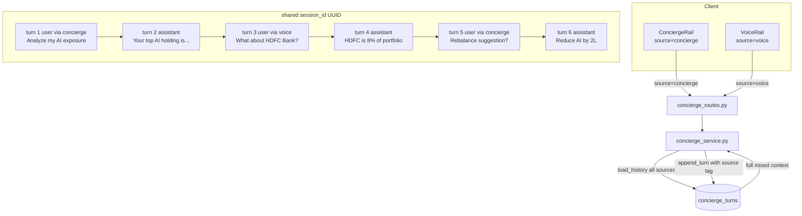

---

## 9. Database Schema

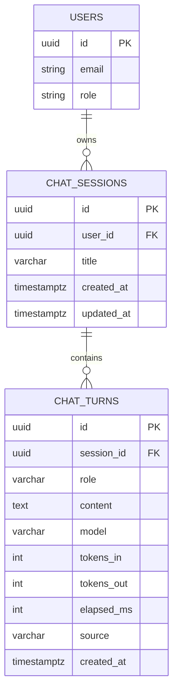

> `role` values: `user` or `assistant` — `source` values: `concierge` or `voice`
> `USERS` lives in Wagner SQLite; the FK is a logical reference only (no DB-level FK constraint across services).

---

## 10. API Wire Format

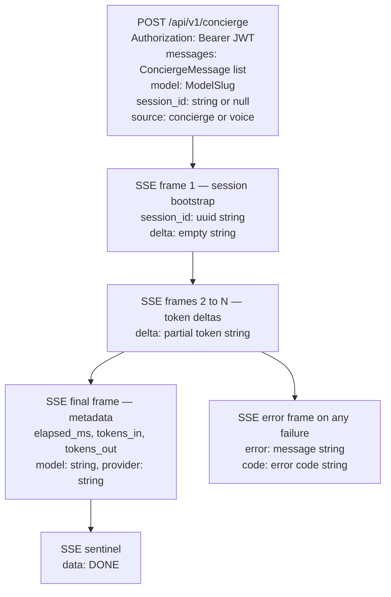

---

## 11. Error Handling

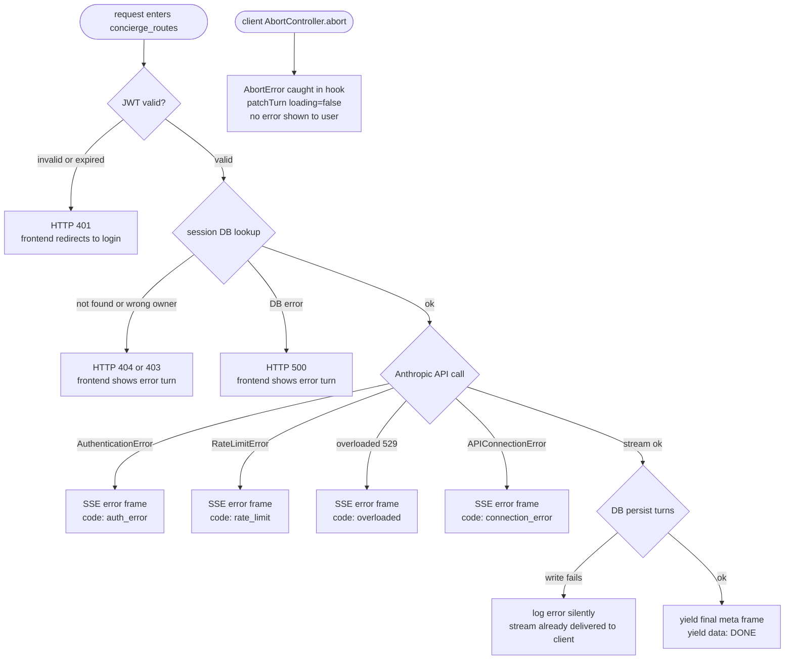

---

## 12. Session State Machine

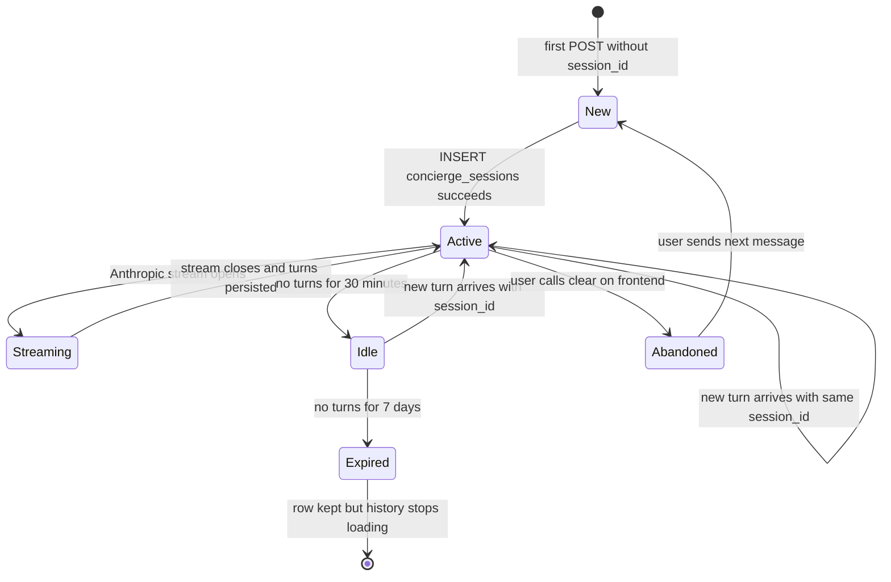

---

## 13. Implementation Order

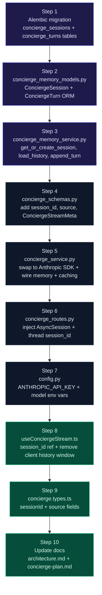

> Legend: **purple** = new DB + backend files, **dark** = modified backend, **green** = frontend + docs
