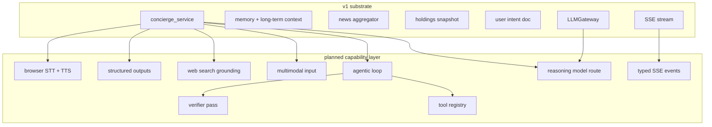

# Concierge Capability Roadmap (Zero Paid Services, Cloud-Only Inference)

Planned capability upgrades for Orff after the v1 concierge substrate in
[4-news-llm-architecture.md](4-news-llm-architecture.md). This document only
tracks features intended for implementation under the current constraints.

## Operating Constraints

| Constraint | Implementation impact |
|---|---|
| Hardware: MacBook Air 16 GB | Avoid local model inference and heavyweight local services. |
| No local ML models | No Ollama, Whisper.cpp, Piper, local embedding models, or local vision models. |
| No Docker | Avoid services that require container runtime for the personal setup. |
| Zero paid services | Use existing local data, browser APIs, and cloud provider free tiers only. |
| Cloud-only inference | Concierge turns require network access; the UI must handle offline state clearly. |

## 1. Planned Provider Stack

| Capability | Planned implementation |
|---|---|
| Reasoning | Route complex portfolio questions to a free reasoning-capable provider through `alphaforge_anton_llm.gateway`. |
| Fast responses | Use the gateway's low-latency free provider route for simple factoid, navigation, and short summary turns. |
| General workhorse | Use the gateway's general free provider route for normal concierge answers. |
| Vision | Use a cloud vision-capable free provider for uploaded charts and PDFs. |
| Structured output | Use native JSON/schema mode where supported, with Pydantic validation at the boundary. |
| Tool calling | Use typed backend tools for prices, holdings, news search, web search, and bounded Python execution. |
| Web grounding | Use DuckDuckGo HTML search first; Brave Search free tier can be enabled by env var. |
| News and social | Reuse the existing `alphaforge-anton-news` aggregator and add sources there, not inside concierge. |
| Voice | Use browser Web Speech APIs for speech-to-text and text-to-speech. |
| Sandboxed computation | Use pyodide or `RestrictedPython` for bounded code execution; no container dependency. |

## 2. Capability Matrix

| # | Capability | Status | Decision doc |
|---|---|---|---|
| A | Multi-tier model routing with reasoning models | Planned | [02](compare/02-claude-model-routing.md), [16](compare/16-reasoning-model.md) |
| B | Agentic loop for multi-step work | Planned | [17](compare/17-agentic-loop.md) |
| C | Multimodal input for charts and PDFs | Planned | [18](compare/18-multimodal-inputs.md) |
| D | Tool/function calling with parallel execution | Planned | [19](compare/19-tool-calling.md) |
| E | Typed streaming events | Planned | [24](compare/24-streaming-protocol.md) |
| F | Browser voice input/output | Planned after text concierge | [20](compare/20-voice-stack.md) |
| G | Web search grounding | Planned | [21](compare/21-web-search-grounding.md) |
| H | Structured outputs and JSON mode | Planned | [22](compare/22-structured-outputs.md) |
| I | Verifier/self-correction pass | Planned | [25](compare/25-verifier-pass.md) |
| J | Multi-layer long-term memory | Planned | [12](compare/12-long-term-memory.md) |
| K | Holdings context injection | Planned | [13](compare/13-holdings-injection.md) |
| L | User intent document | Planned | [14](compare/14-user-intent-doc.md) |
| M | Per-file testability and notebooks | Planned | [15](compare/15-testing-strategy.md) |
| N | News and social source expansion | Planned through news package | [11](compare/11-news-source-expansion.md) |

## 3. User-Facing Outcomes

| User action | Current/basic behavior | Planned concierge behavior |
|---|---|---|
| "What's my AI exposure?" | Generic answer about AI stocks | Reads holdings, computes weighted exposure, cites positions by name. |
| "Should I rebalance?" | One-shot answer | Uses holdings, user intent, risk preferences, and relevant news before drafting. |
| Pasted chart screenshot | Cannot inspect the image | Vision model reads the chart and extracts ticker, indicators, and visible pattern. |
| Uploaded annual report PDF | Cannot inspect the file | Extracts key financial details and compares them to the user's portfolio. |
| "What's RELIANCE trading at?" | May answer from stale context | Calls a price tool and includes a timestamp. |
| "What happened with Adani today?" | Generic news summary | Searches the existing news aggregator, ranks relevant sources, and cites them. |
| Rare/current query | May not know | Uses web grounding and citations. |
| "Read this aloud" | Text only | Browser TTS reads the answer. |
| Voice question | Stubbed UI | Browser STT sends the transcript into the same concierge session. |
| Network down | Request fails | UI shows offline state, preserves the draft, and retries when reconnected. |
| Multi-step allocation question | Best guess in one shot | Planner calls tools, drafts, verifies claims, then returns the answer. |

## 4. Architectural Overlay

The v1 design in [4-news-llm-architecture.md](4-news-llm-architecture.md) remains
the base. Roadmap capabilities layer onto it without replacing the substrate.

## 5. Phased Adoption

### Phase 1 - Substrate (v1)

Implement the order in [4-news-llm-architecture.md section 16](4-news-llm-architecture.md#16-implementation-order):
memory, news context, holdings injection, user intent document, and gateway-backed
SSE streaming on free providers.

### Phase 2 - Modern Chat Layer (v1.1)

1. **Typed streaming events** ([24](compare/24-streaming-protocol.md)) - session, intent, thinking, tool call, tool result, content, citation, verification, and meta events.
2. **Reasoning model route** ([16](compare/16-reasoning-model.md)) - add a reasoning slug for complex portfolio questions.
3. **Foundational tools** ([19](compare/19-tool-calling.md)) - `get_price`, `search_news`, `search_web`, and holdings lookup.
4. **Structured outputs** ([22](compare/22-structured-outputs.md)) - Pydantic schemas plus native JSON/schema mode where available.

### Phase 3 - Multi-Step and Multimodal (v1.2)

5. **Agentic loop** ([17](compare/17-agentic-loop.md)) - bounded plan-execute loop for questions that require multiple tool calls.
6. **Multimodal input** ([18](compare/18-multimodal-inputs.md)) - image and PDF upload support routed to cloud vision.
7. **Verifier pass** ([25](compare/25-verifier-pass.md)) - check portfolio claims, citations, math, and intent-document adherence before final display.
8. **Web grounding** ([21](compare/21-web-search-grounding.md)) - DuckDuckGo HTML search with optional Brave free-tier key.

### Phase 4 - Browser Voice (v1.3)

9. **Voice rail** ([20](compare/20-voice-stack.md)) - browser Web Speech API for input and output, sharing the same session history as text concierge.

## 6. Non-Goals

These are intentionally outside the current implementation plan:

- Paid model APIs and paid fine-tuning.
- Paid voice services such as ElevenLabs, Deepgram, or hosted Whisper.
- Paid news and market data platforms.
- Local LLM inference, including Ollama, LM Studio, llama.cpp, and vLLM.
- Local ML model stacks, including Whisper.cpp, Piper, local embedding models, and local vision models.
- Docker-only services.
- Cloud-hosted vector databases.
- Hosted observability platforms.
- Fully offline concierge turns.

## 7. Offline Behavior

Cloud-only inference means every LLM turn requires network access. When the laptop
is offline:

- The chat UI shows an offline badge.
- The draft message is preserved.
- The pending turn retries after reconnect.
- Local non-LLM views such as holdings, memory, and the intent document remain readable.

## 8. Release Map

| Phase | Adds | User-visible result |
|---|---|---|
| v1 | Memory, holdings, news, intent doc | Orff knows the user and portfolio context. |
| v1.1 | Typed streaming, reasoning route, basic tools, JSON outputs | Orff shows work and uses live data. |
| v1.2 | Agentic loop, vision, verifier, web grounding | Orff can read charts, do multi-step work, and self-check. |
| v1.3 | Browser voice | The user can speak to Orff while online. |

## 9. Open Implementation Questions

- Reasoning trace UI: collapsed inline block or side panel?
- Tool sandbox: pyodide subprocess or `RestrictedPython` with timeouts?
- Provider calibration: which free reasoning route performs best on Indian-market portfolio questions?
- Network retry UX: retry only on browser `online`, or also on timed backoff?
- Sensitive query mode: which fields should be redactable from holdings context before cloud inference?
