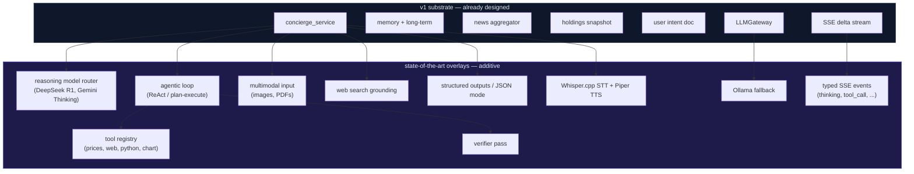

# Concierge — State of the Art (Zero Paid Services, Cloud-Only Inference)

What "state of the art" means for a personal portfolio assistant in 2026, and which capabilities Anton's concierge will adopt while spending ₹0 on third-party services **and running no local ML models**.

> Companion to [4-news-llm-architecture.md](4-news-llm-architecture.md) — that doc covers the v1 plumbing; this doc covers the capability ceiling we're aiming at.

## Operating constraints

| Constraint | Implication |
|---|---|
| **Hardware**: MacBook Air 16 GB | 70B-class local models out of reach; even 14B at Q4 leaves no headroom alongside Anton + browser + IDE. |
| **No local ML models** (no Ollama, no Whisper.cpp, no Piper, no local BGE / Qwen-VL / LLaVA) | All inference happens via cloud free tiers. OS-bundled neural voices (macOS Speech) and WASM runtimes (pyodide) are still allowed because they're not user-installed model weights. |
| **No Docker** (or other container runtimes) | Self-hosted services that traditionally ship as Docker images (SearXNG, etc.) are replaced with cloud-free or pip-installed alternatives. |
| **Zero paid services** | Every cloud call lives within a free tier. |

These constraints don't change *what* concierge does — they change a few of the *how*s. Most of the SOTA capability set is reachable via cloud free tiers in 2026.

---

## 1. The free-SOTA stack (cloud-only)

Free does not mean weak. In 2026 cloud-free-tier LLMs cover nearly the full capability surface of paid frontier APIs — the gaps are in latency consistency, uptime guarantees, and (now) the inability to fall back to local when the network is down.

| Capability | Free option(s) we'll use | Skipped (paid OR local) |
|---|---|---|
| **Reasoning** | DeepSeek R1 (Groq / Cerebras / Together / OpenRouter free routes), Gemini 2.5 Flash Thinking, Qwen 3 reasoning via Groq | Claude Opus 4.7 / OpenAI o-series; local R1 distill |
| **Fast tier** | Groq Llama 3.3 70B (~500 tok/s), Cerebras Llama (~2000 tok/s) | Claude Haiku 4.5; local Llama |
| **General workhorse** | Gemini 2.0 Flash (1M context, multimodal, free tier) | Claude Sonnet 4.6 |
| **Vision** | Gemini 2.0 Flash (free tier), Llama 3.2 Vision via Groq | GPT-4o / Claude vision; local Qwen-VL / LLaVA |
| **Embeddings** (only if RAG revisited) | Gemini `text-embedding-004` (free tier), `gemini-embedding-001` | Voyage / OpenAI; local BGE / nomic |
| **Reranker** | LLM-as-reranker on Groq Llama 3.3 (free) | Cohere / Voyage rerank; local BGE-reranker |
| **STT (speech → text)** | Browser Web Speech API (Chrome routes via Google; free) | OpenAI Whisper API / Deepgram; local Whisper.cpp |
| **TTS (text → speech)** | Browser `speechSynthesis` (uses macOS bundled neural voices) | ElevenLabs / OpenAI TTS; local Piper |
| **Web grounding** | DuckDuckGo HTML scraping (free, no install), Brave Search API free tier (2k/mo), public SearXNG instance (opt-in) | Tavily paid / Perplexity API; self-hosted SearXNG via Docker |
| **Vector store** (only if RAG revisited) | pgvector in existing Postgres (no Docker; native install) | Pinecone / Qdrant Cloud |
| **News / social** | Existing `alphaforge-anton-news` aggregator (RSS + NSE/BSE + Reddit + StockTwits + HN + …) | NewsAPI Business / Bloomberg |
| **Live prices** | yfinance, NSEpy, NSE/BSE official bhavcopy (Python libs; no model) | Polygon / Refinitiv |
| **Code sandbox** (tool calling) | pyodide via Python subprocess (WASM; no Docker) OR `RestrictedPython` with `signal.SIGALRM` timeout | Docker container per call |
| **Local LLM fallback** | **Not available** — see [compare/23-local-llm-fallback.md](compare/23-local-llm-fallback.md) (deferred). | Ollama / LM Studio (require local model weights) |

Every cloud row above is production-viable for a single-user personal app and works through free tiers indefinitely at chat-volume traffic.

---

## 2. The capability matrix

Each row is a state-of-the-art capability; each has a dedicated compare doc.

| # | Capability | Status | Compare doc |
|---|---|---|---|
| A | Multi-tier model routing with reasoning models | In plan | [02](compare/02-claude-model-routing.md) + [16](compare/16-reasoning-model.md) |
| B | Agentic loop (ReAct / plan-execute / verifier) | In plan | [17](compare/17-agentic-loop.md) |
| C | Multimodal input (vision for charts + PDFs) | In plan | [18](compare/18-multimodal-inputs.md) |
| D | Tool / function calling with parallel execution | In plan | [19](compare/19-tool-calling.md) |
| E | Typed streaming (thinking / tool_call / content events) | In plan | [24](compare/24-streaming-protocol.md) |
| F | Voice in/out (local Whisper + Piper) | In plan, post-text | [20](compare/20-voice-stack.md) |
| G | Web search grounding (SearXNG / DuckDuckGo) | In plan | [21](compare/21-web-search-grounding.md) |
| H | Structured outputs / JSON mode | In plan | [22](compare/22-structured-outputs.md) |
| I | Local LLM fallback (Ollama for offline) | **Deferred** (no local models on 16GB MBA) | [23](compare/23-local-llm-fallback.md) |
| J | Verifier / self-correction pass | In plan | [25](compare/25-verifier-pass.md) |
| K | Multi-layer long-term memory | In plan | [12](compare/12-long-term-memory.md) |
| L | Holdings context injection | In plan | [13](compare/13-holdings-injection.md) |
| M | User intent document | In plan | [14](compare/14-user-intent-doc.md) |
| N | Per-file testability + notebooks | In plan | [15](compare/15-testing-strategy.md) |
| O | News + social fan-out (Twitter/Reddit/etc.) | In plan | [11](compare/11-news-source-expansion.md) |

---

## 3. What "state of the art" buys the user

Concrete behavior changes vs. a basic chatbot:

| User action | Basic chatbot | SOTA concierge |
|---|---|---|
| "What's my AI exposure?" | Generic answer about AI stocks | Reads actual holdings, computes weighted exposure, cites positions by name |
| "Should I rebalance?" | Hedged advice + disclaimers | Reasoning model thinks through tradeoffs vs user's stated philosophy (intent doc) and risk tolerance, shows step-by-step |
| Pastes a TradingView chart | "I can't see images" | Vision model reads the chart, identifies the ticker + indicators + pattern |
| Pastes an annual report PDF | "I can't read PDFs" | Extracts text, summarizes key metrics, compares to holdings |
| "What's RELIANCE trading at?" | Stale or hallucinated | Tool call → live price via yfinance → exact answer with timestamp |
| "What happened with Adani today?" | Generic news summary | Aggregator fetches Indian sources + Reddit + StockTwits, ranks, cites |
| "Has anyone reported X?" (rare query) | "I don't know" | Web search grounding via SearXNG, cites |
| "Read this aloud" | n/a | Local Piper TTS, no internet needed |
| "Hey Orff, what's my portfolio doing" | n/a | Whisper.cpp local STT → answer → Piper TTS |
| Internet down | Fails | Fails — cloud-only inference. Surface clear "offline" state in UI; queue the user's turn to retry on reconnect. |
| "Plan a SIP allocation for ₹2L/mo across my profile" | Best guess in one shot | Agentic loop: planner → tool calls (get prices, fetch fundamentals) → drafter → verifier pass → final answer |
| "Did you just hallucinate that?" | "Sorry, you're right!" | Verifier pass already caught it; flagged with `[verified]` / `[unverified]` tags before sending |

---

## 4. Architectural overlay

The v1 design ([4-news-llm-architecture.md](4-news-llm-architecture.md)) is the **substrate**. State-of-the-art capabilities are **overlays** that extend it without replacing it. Each can be added independently:

---

## 5. Phased adoption

Don't ship all of this at once. The substrate (§4 doc) ships first; SOA overlays land in phases.

### Phase 1 — Substrate (v1)

The 11-step implementation order in [4-news-llm-architecture.md §16](4-news-llm-architecture.md#16-implementation-order). Result: a working concierge with memory, news context, holdings injection, and intent doc on free providers.

### Phase 2 — Modern UX layer (v1.1)

Adds the *visible* SOTA features that improve perceived quality immediately.

1. **Typed streaming events** ([24](compare/24-streaming-protocol.md)) — refactor SSE frames into typed events. Frontend renders a "thinking..." indicator, "calling tool X..." indicator, then the actual answer.
2. **Reasoning model integration** ([16](compare/16-reasoning-model.md)) — add `reasoning` model slug routing to DeepSeek R1 or Gemini 2.5 Flash Thinking. Surface reasoning trace in a collapsible UI block.
3. **Tool calling** ([19](compare/19-tool-calling.md)) — add three foundational tools: `get_price(symbol)`, `search_web(query)`, `search_news(query)` (already in the aggregator). Wire via Gemini/Groq native tool-calling.
4. **Structured outputs** ([22](compare/22-structured-outputs.md)) — switch tool arg parsing to native JSON mode; eliminate regex parsing of model output.

### Phase 3 — Agentic + multimodal (v1.2)

The capability jumps that turn "chatbot" into "assistant."

5. **Agentic loop** ([17](compare/17-agentic-loop.md)) — wrap model calls in ReAct or plan-execute pattern. The model can chain multiple tool calls before answering.
6. **Multimodal vision** ([18](compare/18-multimodal-inputs.md)) — accept image attachments in the request; route to Gemini Flash vision; add file upload to the frontend.
7. **Verifier pass** ([25](compare/25-verifier-pass.md)) — cheap second model checks the first's portfolio claims against actual holdings, flags discrepancies inline.
8. **Web search grounding** ([21](compare/21-web-search-grounding.md)) — `search_web` tool wires to self-hosted SearXNG; fallback to DuckDuckGo HTML.

### Phase 4 — Voice (v1.3)

9. **Voice rail** ([20](compare/20-voice-stack.md)) — Browser Web Speech API for both STT and TTS. Zero install. Frontend-only feature: backend just receives the transcript like any text turn. Shared sessions with text rail (already designed in v1 substrate).

**Local LLM offline mode is deferred** under the current hardware + no-local-models constraint. The doc [23](compare/23-local-llm-fallback.md) is kept as a reference for if the constraint relaxes (e.g., upgrading to a 32GB+ machine). Until then, the app is online-only — handle offline gracefully in the UI but don't try to substitute local inference.

### Phase 5 — Proactive (post-v1.3)

11. Background agent that monitors holdings for relevant news + price moves, surfaces alerts in the UI.
12. Calendar awareness (earnings dates, ex-dividend dates, Budget day, FOMC).
13. What-if scenario simulation with historical backtests.

---

## 6. Hard non-goals

To stay free, no-local-models, and no-Docker, we explicitly skip:

- **Paid fine-tuning** of foundation models. RAG + intent doc + facts table covers personalization.
- **Paid voice services** (ElevenLabs, Deepgram, OpenAI Whisper API) — browser Web Speech API is fine.
- **Paid news aggregators** (Bloomberg / Refinitiv / Polygon).
- **Paid search APIs at scale** (Tavily paid, Perplexity API) — DuckDuckGo HTML + Brave free tier cover the tail.
- **Local LLM inference** — no Ollama, LM Studio, llama.cpp, vLLM. Hardware doesn't fit and the constraint is explicit.
- **Local ML models generally** — no Whisper.cpp, Piper, BGE embeddings, BGE-reranker, local vision models. Cloud free tiers (or browser APIs that use OS-bundled functionality) only.
- **Docker / container runtimes** — services normally shipped as containers (SearXNG, vector DBs cloud-edition) are replaced with native installs or cloud free tiers.
- **Cloud-hosted vector DBs** (Pinecone / Qdrant Cloud) — pgvector in existing Postgres if RAG ever lands.
- **Hosted observability** (Datadog / Sentry SaaS) — local logs and SQLite-backed traces are sufficient for single-tenant.

### Implication: no full offline mode

Cloud-only inference means every concierge turn requires network. When the laptop is offline:
- The chat UI shows a clear "offline" badge.
- The user's draft message is preserved.
- The turn auto-retries on reconnect.
- Holdings + intent doc + memory are still readable locally (Postgres + filesystem) for non-LLM views.

This is a real UX gap vs the local-fallback design. The tradeoff is explicit per the constraints.

---

## 7. What ships when

| Phase | Adds | Visible to user as |
|---|---|---|
| v1 | Memory + holdings + news + intent doc | "Orff knows me and my portfolio" |
| v1.1 | Typed streaming, reasoning models, basic tools, JSON outputs | "Orff thinks visibly and uses live data" |
| v1.2 | Agentic loop, vision, verifier, web grounding | "Orff can read charts, do multi-step work, and self-check" |
| v1.3 | Voice rail (browser Web Speech) | "Talk to Orff (online)" |
| post-v1.3 | Proactive agent, backtests, calendar | "Orff reaches out when something matters" |

---

## 8. Open questions

- **Reasoning trace UI**: collapsed by default? Inline? Side panel? See [24](compare/24-streaming-protocol.md).
- **Tool sandboxing without Docker**: pyodide via Python subprocess vs `RestrictedPython` with `signal.SIGALRM`. Decision in [19](compare/19-tool-calling.md).
- **Multi-modal output**: should Orff emit a chart image (matplotlib in sandbox → PNG → embed in response)? Big UX win; deferred to post-v1.3.
- **Privacy boundary documentation**: every cloud provider call sends prompt content over the wire. There is no local-only escape hatch under the current constraints — document this prominently in the user-facing README so the user makes informed choices about what to put in the intent doc and what to ask.
- **Calibration**: which free reasoning model performs best on Indian-market portfolio questions? Needs a small eval set (see [25](compare/25-verifier-pass.md)).
- **Network-down UX**: how aggressive should the auto-retry be? Show the queued message in the composer; retry on `online` event from the browser.
- **Sensitive query mode**: without a local-LLM escape, "privacy mode" can only mean (a) using providers with the best terms (Gemini explicitly says no training on free-tier data as of cutoff; verify), and (b) letting the user redact specific fields from the holdings snapshot before sending. Worth a small Preferences toggle.
