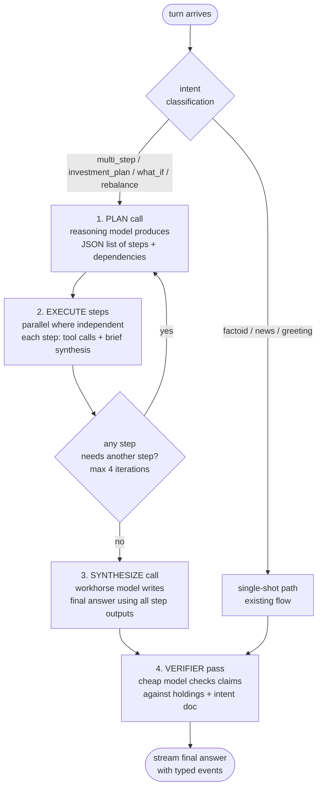

# 17 — Agentic Loop

## Recommended vs Chosen

| | Choice | Cost |
|---|---|---|
| **Recommended** | Plan-execute agentic loop with bounded iterations + verifier pass | Free |
| **Chosen** | **Plan-execute loop with max 4 iterations, parallel tool calls per step, verifier pass at the end.** Single-shot mode kept as default for simple intents; agentic loop opt-in via intent classification (multi-step intents) or explicit `?agent=true` query param. | Free |

---

## Context

A single LLM call ("turn") produces one answer from one input. Real assistant behavior often requires multiple steps: fetch live price → compute weight → compare to intent doc → recommend → verify against constraints. SOTA 2026 patterns wrap the model in an **agentic loop** so it can think, call tools, observe results, and iterate.

## Options

### A. Single-shot (current plan)

Build prompt → call model once → stream answer. No iteration.

### B. ReAct (Reason-Act-Observe)

Classic pattern: model emits a thought + action (tool call); harness executes; result is fed back; loop continues until model emits `final_answer`. Each step is one model call.

### C. Plan-execute

Model first produces a plan (numbered steps). Harness executes each step (possibly in parallel where independent). A final synthesis call writes the answer using all step results.

### D. Multi-agent (planner + workers + critic)

Separate model roles: a planner decomposes, workers execute, a critic reviews. Higher quality but expensive in latency.

### E. Reflexion / self-critique

Model produces an answer, then critiques its own answer, then revises. Bounded iterations.

## Comparison

| Dimension | A. Single-shot | B. ReAct | C. Plan-execute | D. Multi-agent | E. Reflexion |
|---|---|---|---|---|---|
| Model calls per turn | 1 | 1 + N tools | 2 (plan + synth) + N tools | 3+ + tools | 2–3 |
| Latency added | 0 | ~1–3s × N | ~2–5s + tools | ~5–10s | ~2–4s |
| Quality lift | baseline | medium | high | highest | medium |
| Tool parallelism | n/a | sequential per step | parallel within a step | varies | n/a |
| Failure mode | silent hallucination | loops, runaway thinking | clear failure points | coordination overhead | over-correction |
| Build cost | already done | ~150 LOC | ~200 LOC | ~400 LOC | ~100 LOC |
| Streaming UX | smooth tokens | jerky (multiple round-trips) | medium (plan visible first) | choppy | jerky |

## Tradeoffs

- **A. Single-shot** — fine for factoid and "what happened with X" queries. Breaks down on multi-step portfolio analysis where the model needs intermediate facts (live prices, fundamental ratios) it can't generate from training data.
- **B. ReAct** — proven, simple, well-supported in libraries. The downside is sequential tool calls — if Orff needs to fetch 5 ticker prices, that's 5 round trips. Modern model providers (Gemini, Groq) support **parallel tool calling** in a single response, which mitigates this.
- **C. Plan-execute** — best fit for portfolio reasoning. The plan step is visible to the user (good UX: "I'm going to: 1) fetch your current AI exposure, 2) compare to your target, 3) suggest rebalancing"). Execution can parallelize independent steps. Synthesis step ties it together.
- **D. Multi-agent** — overkill for v1.2. Latency cost is brutal for chat UX. Revisit when we have specific workflows (e.g., "build a thesis on Indian renewables") that justify multi-role decomposition.
- **E. Reflexion** — useful as a *complement*, not a replacement. The verifier pass ([25](25-verifier-pass.md)) is essentially a one-shot Reflexion variant.

## Recommendation

**Plan-execute as primary; single-shot for simple intents; verifier always-on.**

### Loop shape



### Step JSON shape (plan call output, enforced via structured output)

```json
{
  "plan": [
    {
      "id": "s1",
      "description": "Fetch current price for RELIANCE, HDFCBANK, TCS",
      "tools": ["get_price"],
      "tool_args": [{"symbol": "RELIANCE"}, {"symbol": "HDFCBANK"}, {"symbol": "TCS"}],
      "depends_on": []
    },
    {
      "id": "s2",
      "description": "Compute current sector weights from updated prices + holdings",
      "tools": ["compute_sector_weights"],
      "tool_args": [{"holdings": "$ref:holdings_snapshot"}],
      "depends_on": ["s1"]
    },
    {
      "id": "s3",
      "description": "Compare current vs target weights from intent doc",
      "tools": [],
      "depends_on": ["s2"]
    }
  ],
  "final_intent": "Recommend rebalancing actions if needed"
}
```

### Iteration bound

- **Max 4 plan iterations** per turn.
- **Max 8 tool calls per step.**
- **Max 30 second wall-clock per turn** (hard timeout).
- If any bound trips, return whatever partial answer is available with an explicit "I hit my reasoning budget" disclosure.

### Streaming behavior (ties to [24](24-streaming-protocol.md))

| Phase | SSE event type |
|---|---|
| Plan call thinking | `thinking_delta` |
| Plan call output | `plan` (typed event with structured JSON) |
| Each step starts | `step_start` |
| Tool call within step | `tool_call` |
| Tool result | `tool_result` |
| Each step ends | `step_complete` |
| Synthesis tokens | `content_delta` |
| Verifier annotations | `verification` (flags) |
| End | `meta` + `[DONE]` |

The frontend renders these as a live "Orff working" panel above the streaming answer.

### When to skip the loop

Intent router ([07](07-intent-classification.md)) decides. Default to single-shot for:

- `greeting`, `factoid`, `news_lookup`, `chitchat`, `clarification`
- Any turn where the previous turn was single-shot and this is a clear follow-up

Force the loop for:

- `investment_plan`, `rebalance`, `what_if`, `multi_step`
- Explicit `?agent=true` query param (frontend toggle)
- User message contains explicit step-by-step request ("break this down")

## Open questions

- **Loop on the workhorse or the reasoning model?** Plan + synthesize on the reasoning model (DeepSeek R1 distill); per-step execution on the workhorse (Gemini Flash) for speed.
- **Parallel tool execution** within a step: use `asyncio.gather` with per-tool timeouts. Already familiar pattern from the news aggregator.
- **User cancellation**: AbortController should kill the loop cleanly mid-iteration. Each iteration must check the cancel token.
- **Cost tracking** per turn: track total tokens across all model calls + tool execution time. Surface in the meta frame.
- **Plan caching**: if the user asks "do that again with HDFC instead of Reliance", can we reuse the plan structure and just swap the tool args? Worth exploring post-v1.2.
- **Failure handling**: if a tool throws inside a step, does the loop retry, skip, or abort? Default: surface the error in `tool_result`, let the model decide.
