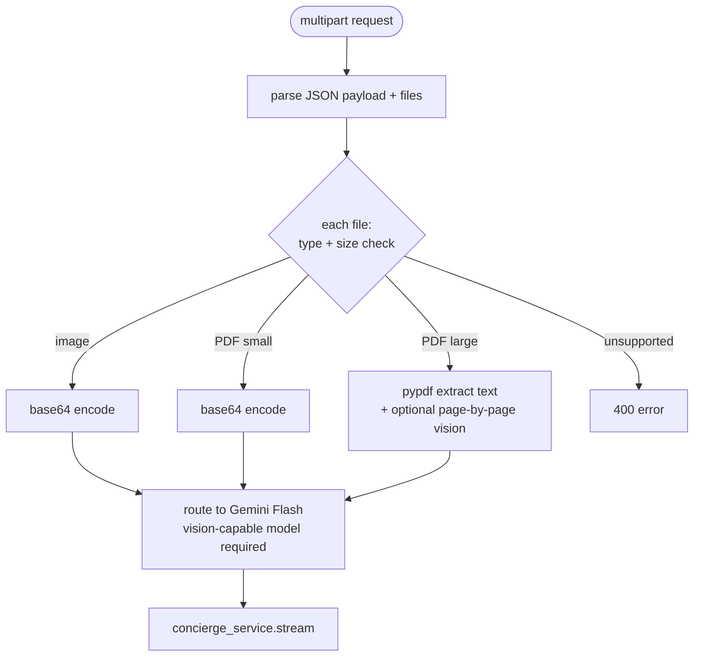

# 18 — Multimodal Inputs (Vision + Documents)

## Recommended vs Chosen

| | Choice | Cost |
|---|---|---|
| **Recommended** | Accept images + PDFs in requests; route to Gemini 2.0 Flash (free, multimodal); render attachments in chat UI | Free |
| **Chosen** | **Image attachments (PNG/JPG) and PDFs (≤ 20 pages) accepted. Gemini 2.0 Flash handles vision and PDF parsing in one call (cloud). `pypdf` (pure-Python library, not an ML model) extracts text from large PDFs and feeds it as a text block. Llama 3.2 Vision via Groq as cloud failover when Gemini quota hits. Frontend adds drag-drop + paste-from-clipboard.** | Free |

**Why the deviation**:
- Original chosen path included Qwen-VL via Ollama for offline vision — dropped per no-local-models rule.
- Original chosen path mentioned `pytesseract` OCR as fallback — Tesseract bundles a model, dropped to be conservative under the no-local-models rule.
- `pypdf` is a pure-Python parser for native digital PDFs (no ML) — kept; it's fast and gives clean text extraction.

**Implication**: vision is cloud-only. If both Gemini Flash AND Groq Llama 3.2 Vision are down or rate-limited, image-bearing turns fail with an explicit error (frontend tells the user to try again or describe the image in words). No silent fallback.

---

## Context

The planned multimodal path lets users paste a TradingView chart screenshot, upload an annual report PDF, drag-drop a Tweet image, and have Orff inspect it. Free multimodal routes cover the required input types.

Use cases for a portfolio assistant:

- **Charts**: TradingView screenshots, broker app screenshots, hand-drawn analysis
- **Annual reports / DRHPs**: PDF, often 100+ pages → focus on extracted key sections
- **Earnings call decks**: PDF slides
- **News article screenshots**: when the source isn't in any RSS feed
- **Bank statements / trade confirmations**: PDF
- **Whiteboard photos**: user's own analysis

## Options

### A. Cloud multimodal (Gemini Flash)

Send image bytes (base64 or URL) to Gemini 2.0 Flash. Free tier handles vision + PDF natively. 1M context absorbs even large documents.

### B. Local vision (Qwen-VL, LLaVA via Ollama)

Run a vision model locally. No data leaves the machine. Slower (CPU/GPU dependent), lower quality than Gemini Flash currently.

### C. Two-step: local extraction + text-only LLM

Extract text/structure locally (`pypdf` for PDFs, `pytesseract` for images), feed to any text LLM. Loses visual context (chart shapes, layout) but works with every provider.

### D. Hybrid: cloud for vision, local for PDF text

Images → cloud vision; PDFs → local text extraction + text LLM. Optimizes for what each handles well.

## Comparison

| Dimension | A. Cloud vision | B. Local vision | C. Local extraction | D. Hybrid |
|---|---|---|---|---|
| Image quality | Excellent | Medium | None | Excellent |
| PDF quality | Excellent (handles tables, layout) | Medium | Good for text, none for layout | Good |
| Latency | ~2–4s | ~5–20s (depends on hardware) | <1s | ~2–4s |
| Privacy | Sent to Google | Stays local | Stays local | Mixed |
| Setup cost | API key (free) | Model weights (~10–30GB) | `pypdf` install | Both |
| Provider lock-in | Gemini family | None | None | Partial |
| Offline mode | No | Yes | Yes | Partial |

## Tradeoffs

- **A. Cloud vision (Gemini Flash)** — clear quality winner today. Free tier is generous. The privacy crossover is real (images leave the machine) but consistent with text being sent to the same provider already.
- **B. Local vision** — viable on Apple Silicon M-series with Qwen-VL-7B or LLaVA-NeXT. Quality is improving fast but still trails Gemini Flash for chart understanding. Worth wiring up for the "offline mode" path ([23](23-local-llm-fallback.md)).
- **C. Local extraction** — `pypdf` for PDFs is excellent for native digital PDFs; `pytesseract` for OCR on scanned PDFs or chart screenshots is medium quality but free and offline. Loses chart-shape understanding entirely.
- **D. Hybrid** — best of both worlds for selective use cases. PDFs of annual reports are 95% text; extracting locally and feeding to a text LLM is faster and cheaper than sending the whole PDF to a vision model. Chart screenshots need vision.

## Recommendation

**A as primary (Gemini Flash for everything), with D's local PDF extraction as a complementary fast path.**

Specifically:

1. **All image attachments → cloud vision** (Gemini 2.0 Flash).
2. **PDFs ≤ 20 pages → cloud vision** (Gemini Flash handles PDFs natively, preserves layout).
3. **PDFs > 20 pages → local extraction first**: `pypdf` extracts text + structure → feed extracted text as a system block; if the user asks something the extraction missed (charts/diagrams), offer to send the relevant page to vision.
4. **Offline mode ([23](23-local-llm-fallback.md))** uses B + C: local Qwen-VL for images, local `pypdf` for PDFs.

### Request shape (extending the SSE plan)

```
POST /api/v1/concierge
Content-Type: multipart/form-data

fields:
  payload: <JSON of ConciergeRequest (existing)>
  attachments[]: <file 1>
  attachments[]: <file 2>
  ...
```

Backend pipeline:



### Model routing implications

If the request includes any attachments → force the model slug to a vision-capable one:

| Provider | Vision-capable free models |
|---|---|
| Gemini | 2.0 Flash, 2.5 Flash Thinking, 2.5 Pro |
| Groq | Llama 3.2 Vision 11B / 90B |
| Local (Ollama) | Qwen-VL, LLaVA-NeXT, MiniCPM-V |
| Cerebras | None as of cutoff |

Default vision route: **Gemini 2.0 Flash** (best quality/free-tier balance). Fallback: **Llama 3.2 Vision via Groq** if Gemini quota exhausted.

### Frontend UX

- **Drag-drop zone** on the chat composer.
- **Paste from clipboard** (Cmd-V on an image) handled by the composer.
- **Image preview** above the composer before send.
- **PDF page-count indicator** (e.g., "annual_report.pdf — 184 pages, will use local extraction").
- **Per-attachment opt-out**: a small "this image stays local" toggle that forces the offline vision route.

### Storage

Attachments are **not persisted server-side** in v1. They're held in memory for the duration of the request, sent to the LLM provider, and discarded. The conversation history persists only the *text representation* (or a short caption the model produced). This avoids storage growth and reduces sensitive-data sprawl.

Future extension: opt-in persistence with `concierge_attachments` table for re-reference in later turns.

## Limits

| File type | Max size | Max count per request |
|---|---|---|
| Image (PNG/JPG/WebP) | 10 MB each | 8 |
| PDF | 50 MB | 3 |
| Total request size | 100 MB | — |

Enforced at the FastAPI route level; reject with 413 before any model call.

## Open questions

- **Chart-specific prompt scaffolding**: when the user pastes a chart, prepend a system note: "This is a financial chart screenshot. Identify the ticker, timeframe, indicators, and notable patterns." Improves output quality.
- **OCR fallback** when vision misreads ticker symbols on small chart screenshots? Worth piping `pytesseract` for the ticker region.
- **Multi-page PDF strategy**: for a 200-page annual report, do we send all pages, summary pages only, or let the model request pages on demand via a tool? Default: extract text locally; if user asks about charts/diagrams, send specific pages on demand.
- **Frontend image compression**: re-encode large PNGs as 1080p JPGs client-side before upload to save bandwidth.
- **Vision in voice mode**: can the user say "look at this chart" while pointing the camera? Out of scope for v1.3 voice; revisit.
