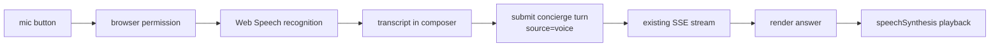

# 20 - Voice Stack (Browser STT + TTS)

## Recommended vs Chosen

| | Choice | Cost |
|---|---|---|
| **Recommended** | Browser Web Speech API for both speech-to-text and text-to-speech | Free |
| **Chosen** | **Same as recommended.** Voice is frontend-only: the backend receives a transcript like any text turn, and the frontend reads responses aloud via `speechSynthesis`. | Free |

This document intentionally excludes local model stacks. Under the current constraints
there is no `voice/` workspace package, no backend voice service, and no local STT/TTS
model installation.

## Context

Voice is a browser rail over the existing concierge session model. It should let the
user ask portfolio questions hands-free and hear responses aloud while keeping the
backend path identical to text concierge.

## Chosen Design

| Layer | Implementation |
|---|---|
| Speech-to-text | Browser Web Speech API. Chrome may route audio to Google; Safari may use Apple dictation behavior. The UI must disclose this before enabling voice. |
| Text-to-speech | Browser `speechSynthesis`, using OS/browser-provided voices. |
| Backend | No voice-specific module. The transcript is submitted to the existing concierge endpoint with `source: "voice"`. |
| Session continuity | Voice and text share `concierge_sessions` and `concierge_turns`; the `source` column distinguishes modality. |
| UX trigger | Push-to-talk only for v1.3. No wake word or always-listening mode. |

## Frontend Flow



## Backend Contract

Voice uses the same request path as text:

```json
{
  "session_id": "existing-or-null",
  "messages": [{"role": "user", "content": "What is my portfolio doing today?"}],
  "model": "auto",
  "source": "voice"
}
```

No audio bytes are sent to the backend. This keeps storage, auth, logging, and memory
behavior identical to the text rail.

## Tradeoffs Accepted

- Chrome speech recognition can send audio to Google's service. The UI must make that explicit.
- Browser support and voice quality vary by OS and browser.
- There is no custom Indian-English voice pack under the current no-local-model rule.
- There is no wake-word mode in v1.3.
- TTS playback is controlled by browser APIs, so interruption behavior is implemented in the frontend.

## Implementation Notes

1. Add a voice button and recording state to the concierge composer.
2. Use `SpeechRecognition` / `webkitSpeechRecognition` where available.
3. Put the recognized transcript in the composer before sending so the user can edit it.
4. Submit through the existing concierge stream hook with `source: "voice"`.
5. Add answer playback using `SpeechSynthesisUtterance`.
6. Provide stop/replay controls on the current assistant message.
7. Show a browser-support fallback when Web Speech APIs are unavailable.

## Open Questions

- Should transcript review be mandatory, or can the user enable auto-send?
- Should answer playback default to on only for turns started by voice?
- Should voice be disabled in private/sensitive mode unless the browser can keep STT local?
- Which browser/OS combinations need explicit support testing?
