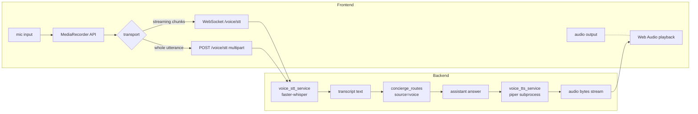

# 20 — Voice Stack (STT + TTS)

## Recommended vs Chosen

| | Choice | Cost |
|---|---|---|
| **Recommended** | Local Whisper.cpp for STT + local Piper for TTS; browser-native fallback | Free (local compute) |
| **Chosen** | **Browser Web Speech API for both STT and TTS. Zero install, zero local model weights. Frontend-only feature: the backend just receives a transcript like any text turn, and renders responses as text that the frontend speaks aloud via `speechSynthesis`.** No `voice/` workspace package. | Free |

**Why the deviation**: the no-local-models rule rules out Whisper.cpp and Piper. The remaining free options are browser-native APIs or paid cloud STT. Browser APIs win.

**Tradeoff accepted**:
- STT in Chrome routes audio to Google's cloud (privacy crossover). Document this clearly in the UI when voice is enabled.
- STT in Safari uses Apple's on-device dictation (no cloud send) — actually a privacy win for macOS users.
- TTS (`speechSynthesis`) uses OS-bundled neural voices. macOS has high-quality Indian English voices (Veena, Rishi). No data leaves the device for TTS.
- Recognition quality is good but not Whisper-medium-level; acceptable for portfolio queries.
- No streaming TTS by sentence boundary like Piper offered; the browser API streams natively via SpeechSynthesisUtterance queue — acceptable but not as fine-grained.

**Voice is frontend-only under this design**. No new backend module, no new workspace package. The backend can't tell a voice turn from a text turn except by the `source: 'voice'` flag already in the schema.

---

## Context

State-of-the-art voice for a personal assistant in 2026 means: hands-free portfolio queries, response read aloud, no cloud audio dependency, low enough latency to feel live.

Voice is in the original plan as a future extension. This doc commits to the technology stack so v1.3 has a clear target.

## Options — STT (speech → text)

| Engine | Local/cloud | Latency | Quality (Indian English) | Setup |
|---|---|---|---|---|
| **Whisper.cpp** (small / medium / large) | Local C++ | 0.5–2s | Excellent (small fine), Excellent+ (medium) | Build + model file (~250MB–1.5GB) |
| **faster-whisper** (CTranslate2) | Local Python | Faster than whisper.cpp on GPU | Same as Whisper | `pip install faster-whisper` |
| **Browser Web Speech API** | Cloud (Chrome → Google) | <1s | Good (depends on browser) | Zero install; works in browser only |
| **Vosk** | Local | Very fast | Medium | Smaller models; less accurate |
| **OpenAI Whisper API** | Cloud (paid) | ~1s | Excellent | API key + $ |
| **Deepgram** | Cloud (paid) | <500ms (streaming) | Excellent | API key + $ |

## Options — TTS (text → speech)

| Engine | Local/cloud | Voice quality | Indian English voice | Setup |
|---|---|---|---|---|
| **Piper** | Local C++ | Very good (neural) | Yes (e.g., `en_IN-...` voices) | Build + voice file (~50MB per voice) |
| **Coqui TTS** | Local Python | Excellent | Limited Indian voices | `pip install TTS` |
| **Browser Web Speech API** | OS-native | Good | OS-dependent | Zero install |
| **OpenAI TTS** | Cloud (paid) | Excellent | Yes | API key + $ |
| **ElevenLabs** | Cloud (paid) | Best-in-class, voice cloning | Yes | API key + $ |
| **eSpeak-NG** | Local | Robotic | Yes | Trivial install |

## Tradeoffs

### STT

- **Whisper.cpp** — the obvious local pick. Quality is excellent for Indian English at the medium model size. Latency on Apple Silicon M-series is <1s for short utterances. No data leaves the machine.
- **faster-whisper** — equivalent quality, sometimes lower latency. Python-native, easier to integrate with FastAPI. Choose this over whisper.cpp if happy with a Python dep.
- **Browser Web Speech API** — zero install, works immediately. But sends audio to Google (in Chrome) — privacy crossover that we're avoiding elsewhere. Use as fallback only when local Whisper isn't available.
- **OpenAI/Deepgram** — excellent but paid. Skip per the no-paid constraint.

### TTS

- **Piper** — the local TTS winner in 2026. Voice quality close to ElevenLabs for stock voices, runs anywhere, fast. Has Indian English voices.
- **Coqui TTS** — strong quality, slower, more setup complexity. Worth revisiting if Piper voices feel limiting.
- **Browser Web Speech API** — OS-dependent quality (macOS voices are good; Windows depends; mobile depends). Easy fallback.
- **Cloud TTS (ElevenLabs/OpenAI)** — best voices today but paid. Skip.

## Recommendation

**Whisper.cpp (medium model) + Piper (Indian English voice) as primary; Web Speech API as zero-install fallback.**

Specifically:

- **STT**: `faster-whisper` with the `medium` model. Python-native (easier integration), GPU-accelerated where available, ~1s latency on M-series for typical utterances.
- **TTS**: `piper` (compiled C++ binary called as a subprocess) with `en_IN-...` voice. Streamed output for low-latency playback.
- **Fallback**: if local engines aren't installed, frontend uses Web Speech API. Documented as a degraded mode.

## Architecture



### Streaming TTS

Piper supports streaming output (sentence-by-sentence). As the LLM streams tokens, we accumulate by sentence boundary and pipe each completed sentence to Piper. The user hears the first sentence within ~1s of the model starting to speak — feels real-time.

### Session continuity

Voice and text share the same `concierge_turns` table (already in the v1 plan; `source` column distinguishes). Switching from voice to text mid-conversation Just Works because both modalities write to the same session.

### Wake word / push-to-talk

- **v1.3**: push-to-talk only (user presses a button or holds spacebar). No wake word.
- **post-v1.3**: optional wake word via `openWakeWord` (local, free). Defer; wake word always-on listening is invasive.

## Packaging

Create a new workspace package `voice/` mirroring `news/` and `llm/`:

```
voice/
├── src/
│   └── alphaforge_anton_voice/
│       ├── __init__.py
│       ├── stt.py              # WhisperSTT wrapper
│       ├── tts.py              # PiperTTS wrapper
│       ├── streaming.py        # sentence-boundary chunker for streaming TTS
│       └── voices/             # piper voice files (gitignored; download script)
├── tests/
├── notebooks/
│   ├── 01_stt.ipynb            # transcribe sample audio
│   ├── 02_tts.ipynb            # synthesize sample text; latency measurement
│   └── 03_end_to_end.ipynb     # mic → transcript → LLM → audio
├── PLAN.md
└── pyproject.toml
```

Backend facade at `backend/app/modules/voice/` thinly wraps and exposes:

- `POST /api/v1/voice/stt` — multipart audio → text
- `WS /api/v1/voice/stream` — bidirectional streaming for live transcription
- `POST /api/v1/voice/tts` — text → audio stream
- `GET /api/v1/voice/voices` — list installed Piper voices
- `GET /api/v1/voice/health` — engine availability

## Hardware footprint

Reasonable single-user setup:

| Component | RAM | Disk | CPU/GPU |
|---|---|---|---|
| Whisper medium | ~1GB during inference | ~1.5GB | Apple Silicon: comfortable on M1+; Linux: 4+ cores or any GPU |
| Piper voice | ~200MB during synth | ~50MB per voice | trivial |

Both run comfortably alongside the rest of Anton on a developer laptop.

## Open questions

- **Voice selection UI**: let the user pick from installed Piper voices (male/female, regional accent). Add to Preferences.
- **Interruptibility**: while Piper is reading the answer, user starts speaking → stop playback and listen. Need echo cancellation on the mic side.
- **Multi-language**: should Hindi STT/TTS be supported for code-switched queries? Whisper handles Hindi natively; Piper has Hindi voices. Default to English-only in v1.3; add Hindi opt-in later.
- **Voice as primary modality (mobile)**: voice-first PWA / mobile app is out of scope but a natural extension.
- **Latency budget end-to-end**: utterance end → first audio byte back. Target < 3s for short queries; < 5s for portfolio analysis. Need to measure.
- **Privacy default**: voice mode probably wants to default to local-only LLM (Ollama) since the user often speaks more candidly than they type. Worth a toggle.
