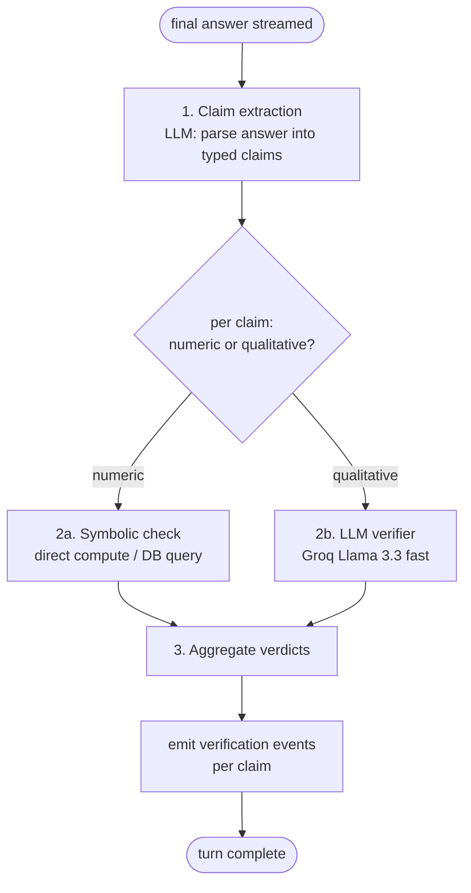

# 25 — Verifier / Self-Correction Pass

## Recommended vs Chosen

| | Choice | Cost |
|---|---|---|
| **Recommended** | Cheap verifier model checks claims against holdings + intent doc + tool results; flags inline | Free |
| **Chosen** | **Two-mode verifier: structured claim extraction from the answer, then per-claim verification against ground truth (holdings snapshot, intent doc, tool results from this turn). Runs in parallel after content streaming completes. Emits `verification` events with verified/unverified/contradicted verdicts. Uses Groq Llama 3.3 fast model (~500ms).** | Free |

---

## Context

LLMs confabulate. Even reasoning models occasionally invent ticker symbols, misstate portfolio weights, attribute news to the wrong company, or recommend actions that contradict the user's stated exclusions. The verifier pass exists to catch those issues before they reach the user.

The verifier is the difference between "trust the answer" and "double-check everything Orff says."

## What to verify

| Claim type | Ground truth source | Failure mode if not verified |
|---|---|---|
| Portfolio numbers (weights, P&L, position sizes) | Holdings snapshot ([13](13-holdings-injection.md)) | Hallucinated allocations user might act on |
| Intent-doc adherence (exclusions, risk tolerance) | User intent doc ([14](14-user-intent-doc.md)) | Recommendation violates user's stated rules |
| News citations | News tool results from this turn | Cited URL doesn't exist or doesn't say what's quoted |
| Prices / fundamentals | `get_price` / `get_fundamentals` tool results | Stale or invented numbers |
| Math (arithmetic in answers) | Direct compute | Wrong sums; especially compounded returns |
| Date / time-bound facts | Current date + tool result timestamps | "Last quarter" referring to wrong quarter |

## Options

### A. No verification

Trust the model. Bad.

### B. Inline self-critique in same model call

Append "now check your answer for accuracy" to the prompt. Cheap but biased — same model checking itself.

### C. Separate verifier model

Cheap fast model (Groq Llama 3.3) reviews the answer against structured ground truth. Independent perspective.

### D. Symbolic verification

Extract claims as structured assertions; check each against a deterministic source (DB query, arithmetic). No LLM needed for the check.

### E. Hybrid: D for numeric claims, C for natural-language claims

Numeric claims (weights, prices, returns) are exactly checkable — use D. Qualitative claims (intent-doc adherence, news interpretation) need judgment — use C.

## Recommendation

**E. Hybrid — symbolic verification for what's exactly checkable; LLM verifier for the rest.**

### Pipeline



### Claim extraction schema

```python
class ExtractedClaim(BaseModel):
    id: str
    text: str                          # the claim as stated in the answer
    type: Literal["numeric", "qualitative", "citation", "math", "temporal"]
    subject: str | None                # e.g. "RELIANCE", "AI sector"
    metric: str | None                 # e.g. "weight", "P&L", "price"
    value: float | str | None          # the asserted value
    units: str | None                  # "%", "₹", etc.
    cite_id: str | None                # references a citation event
```

### Symbolic check examples

```python
# numeric claim: "your AI exposure is 28%"
def check_weight_claim(claim: ExtractedClaim, holdings: list[Holding]) -> VerdictResult:
    actual = compute_sector_weight(holdings, sector="AI")
    asserted = claim.value
    if abs(actual - asserted) < 0.5:
        return Verdict.VERIFIED
    elif abs(actual - asserted) < 2.0:
        return Verdict.APPROXIMATE
    else:
        return Verdict.CONTRADICTED  # actual vs asserted

# citation claim: "[1] Moneycontrol says ..."
def check_citation(claim: ExtractedClaim, citations: list[Citation]) -> VerdictResult:
    cite = next((c for c in citations if c.id == claim.cite_id), None)
    if cite is None:
        return Verdict.UNVERIFIED  # cite_id invented
    # ... check that the cited text appears in the article
```

### LLM verifier prompt (for qualitative claims)

```
You verify factual claims against provided context. For each claim, output:
- verdict: verified | unverified | contradicted | approximate
- evidence: one-line justification (or "no evidence in context")

CONTEXT:
{holdings_snapshot}
{intent_doc}
{tool_results}

CLAIMS:
{numbered list of qualitative claims}

Respond with JSON array matching VerifierResult schema.
```

Use **Groq Llama 3.3 70B** (fast, free, quality is fine for verification). Schema-constrained output via JSON mode.

### Verdict UX

Each `verification` SSE event ([24](24-streaming-protocol.md)) carries one claim's verdict:

```json
{
  "claim": "AI sector exposure is 28%",
  "verdict": "verified",
  "evidence": "computed from current holdings"
}
{
  "claim": "Earnings on Friday",
  "verdict": "unverified",
  "evidence": "no earnings calendar source available"
}
{
  "claim": "Adani Green up 12% today",
  "verdict": "contradicted",
  "evidence": "get_price tool result shows -3.4%"
}
```

UI renders inline marks next to the answer:
- ✓ verified
- ≈ approximate
- ? unverified
- ✗ contradicted

Hover/tap shows the evidence line.

### When to skip verification

- **Greeting / chitchat** intents — nothing to verify.
- **Pure summarization** turns — claims are downstream of the news context; can verify against news only.
- **Explicitly opted out** (`?verify=false` query param for power users / debugging).

Default: verify all `portfolio`, `investment_plan`, `what_if`, `rebalance`, `multi_step` intents.

## Performance

- Claim extraction: ~200ms (small prompt, fast model)
- Symbolic checks: <50ms (in-memory DB queries + arithmetic)
- LLM verifier (parallel per batch of claims): ~500ms

Total verifier overhead per turn: **~600–800ms**, runs **after** content streaming starts so the user sees the answer immediately and verification appears shortly after.

## Eval / calibration

Build a labeled corpus of (answer, claims, ground-truth verdicts) — say 100 examples — and measure:

- **Recall**: % of false claims caught
- **Precision**: % of flagged claims that are actually false (false-positive rate)
- **Latency P50/P99**

Iterate the verifier prompt and threshold values against this corpus. Notebook `concierge/notebooks/10_verifier_eval.ipynb`.

## Failure modes to design against

| Failure | Mitigation |
|---|---|
| Verifier itself hallucinates verdicts | Schema-constrained output; require `evidence` to reference a specific context source |
| Verifier over-flags (false positives) | Threshold-tune; show `approximate` verdict rather than `contradicted` for close numerics |
| Verifier under-flags (false negatives) | Symbolic checks for what's exactly checkable; LLM only for the rest |
| Claim extractor misses a claim | Extraction prompt has examples of subtle claim types; eval corpus catches these |
| Verifier latency exceeds budget | Hard 2s timeout; surface unverified-due-to-timeout marks |

## Future: Reflexion-style revision

Beyond flagging, the verifier could trigger a **revision pass**: if any `contradicted` verdicts appear, the original model gets the verdicts back and writes a corrected answer. Better quality but doubles latency. Defer to v1.3+.

## Open questions

- **Where in the streaming order does verification fire?** After full content streams (today's plan) keeps perceived latency low but the user sees the answer briefly before flags appear. Alternative: hold the answer until verified — slower but more honest. Pick "stream then flag" with clear visual indicators that verification is in progress.
- **Per-claim confidence**: should verdicts include a confidence score (0–1)? Useful for UI; expensive to elicit. Default to discrete verdicts; add confidence later if needed.
- **User-corrected verdicts**: if the user clicks "this verdict is wrong", store as feedback for prompt iteration. Useful loop; defer the storage layer.
- **Verifier disagreement on the same claim across runs**: with sampling temperature > 0, two verifier runs may disagree. Use `temperature=0` for the verifier always.
- **Verifier-internal symbolic helpers**: arithmetic for "compounded over 5y" is non-trivial. Use sympy in the symbolic path for exactness; defer until first observed failure.
- **Verifier on streaming content**: could fire incrementally as content streams (per-sentence verification). Smoother UX; harder to engineer. Defer.
