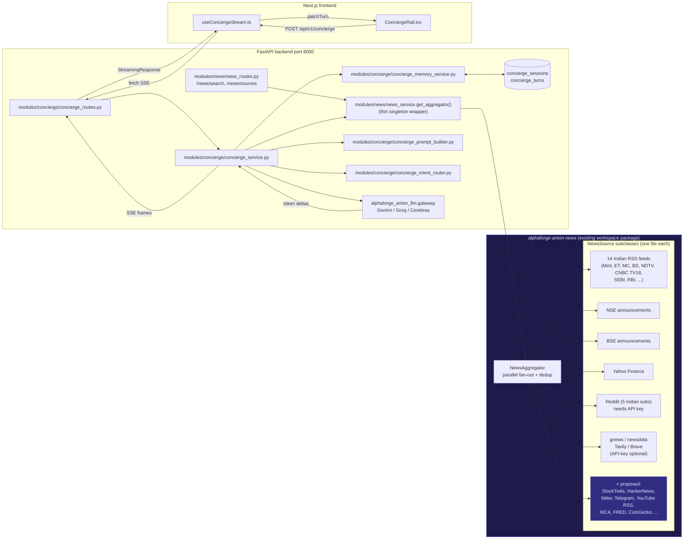
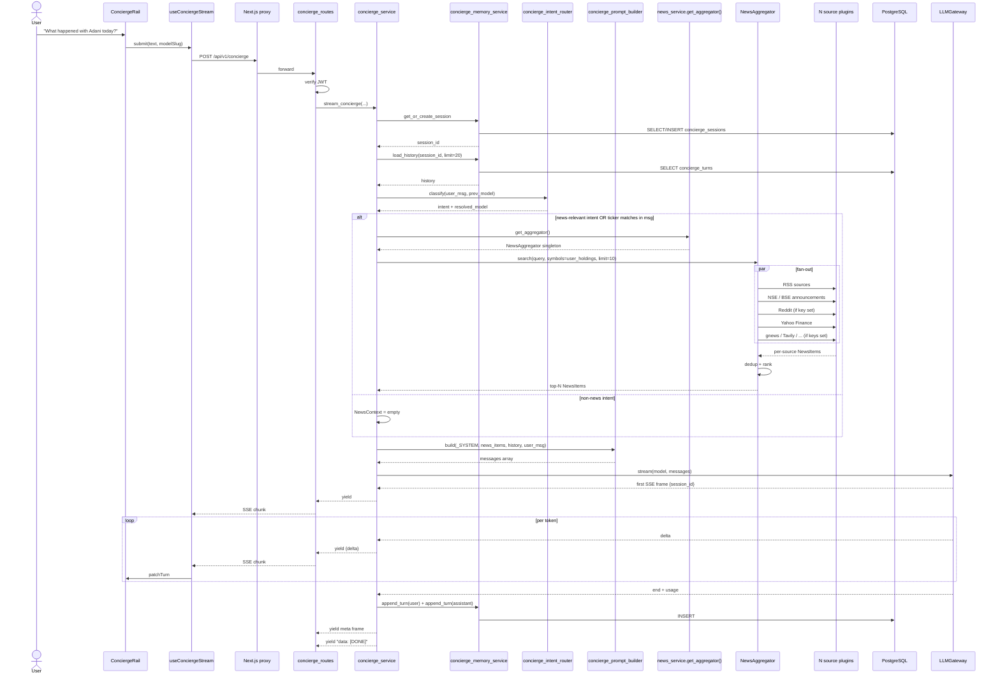
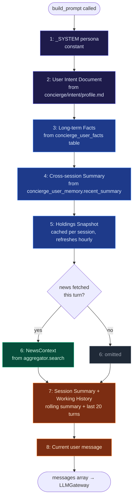
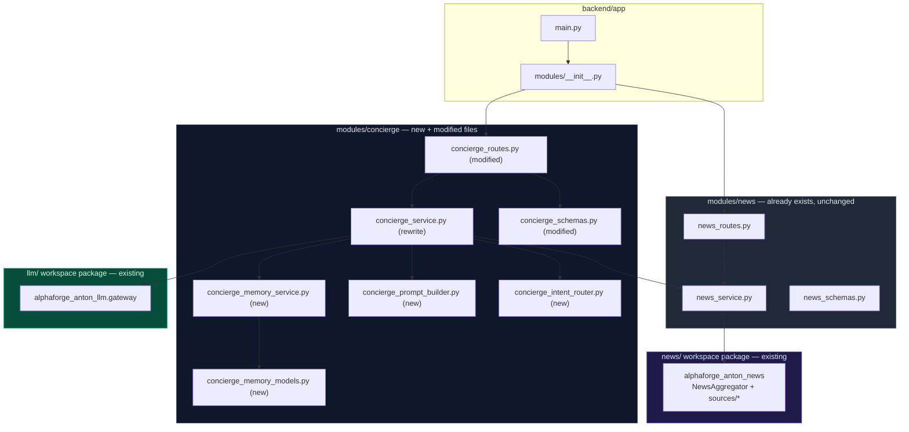
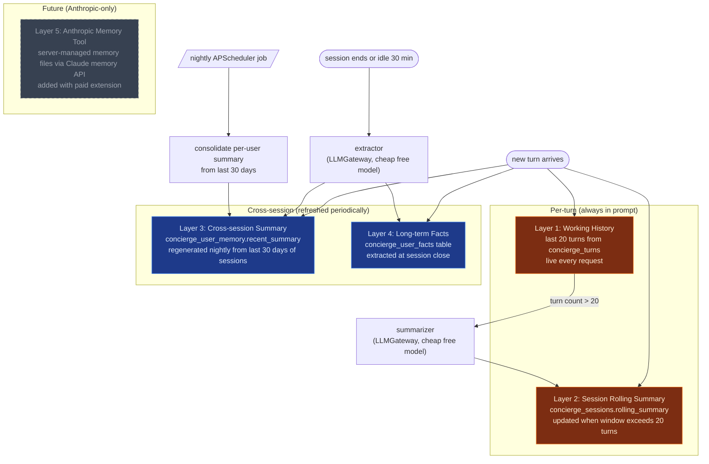
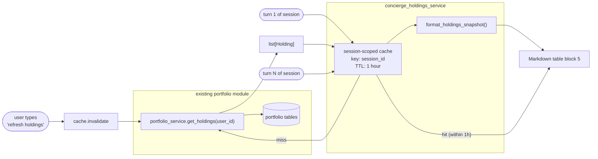

# Concierge — News + LLM Architecture (Chosen Path)

End-to-end design for the path the [compare/](compare/) docs ultimately chose:
**existing `alphaforge-anton-news` aggregator → existing LLMGateway (free providers) → SSE → frontend.**
No paid services in v1. Anthropic direct API is an opt-in extension layered on later.

> This doc is design-only. It operationalizes the choices from [1-concierge-plan.md](1-concierge-plan.md) and the `Chosen` rows in [compare/](compare/).

---

## 0. Key reuse decisions

**Don't build news ingestion inside concierge.** The repo already ships a self-contained workspace package `alphaforge-anton-news` ([news/](../news/)) that:

- Defines a `NewsSource` ABC — every source is a one-file subclass.
- Auto-registers sources via `sources/__init__.py:build_all_sources()`.
- Fans out to all enabled sources in parallel via `asyncio.gather`.
- Deduplicates by canonical URL + title hash.
- Already wraps **14 Indian RSS feeds**, **NSE & BSE corporate announcements**, **Yahoo Finance per-symbol news**, **Reddit** (5 Indian subs), plus optional **gnews / newsdata / Tavily / Brave**.
- Has a backend facade at [backend/app/modules/news/](../backend/app/modules/news/) exposing `/api/v1/news/search` and `/api/v1/news/sources`.
- Has zero coupling to the LLM layer — `concierge` imports it cleanly.

**Concierge integrates by calling `get_aggregator().search(query, symbols, limit)` on demand per turn.** No new DB tables for news. No new background scheduler. No new RSS poller. The aggregator is the abstraction; everything new lives in `concierge` or as new source files inside `alphaforge-anton-news`.

To add sources later (Twitter, StockTwits, HackerNews, Telegram, etc.), drop a new file in [news/src/alphaforge_anton_news/sources/](../news/src/alphaforge_anton_news/sources/) and register it. See [compare/11-news-source-expansion.md](compare/11-news-source-expansion.md) for the backlog and the extensibility contract.

---

## 1. System Overview



---

## 2. NewsSource Extensibility Contract

(Reference: this is the existing contract in [news/src/alphaforge_anton_news/base.py](../news/src/alphaforge_anton_news/base.py). Reproduced here so concierge readers don't need to chase the package.)

```python
class NewsSource(ABC):
    name: str                     # unique slug, e.g. "stocktwits"
    display_name: str             # UI label, e.g. "StockTwits"
    env_key: str | None = None    # env var that enables; None = always-on
    requires_api_key: bool = False
    category: str = "api"         # "rss" | "api" | "social" | "regulatory" | "video" | ...

    @abstractmethod
    async def search(
        self,
        query: str,
        symbols: list[str] | None = None,
        since: datetime | None = None,
        limit: int = 10,
    ) -> list[NewsItem]: ...

    @abstractmethod
    async def health(self) -> SourceHealth: ...
```

**Adding a new source = three steps:**

1. Create `news/src/alphaforge_anton_news/sources/<name>.py` implementing the ABC.
2. Add one line to `sources/__init__.py:build_all_sources()`.
3. (Optional) Set the env var that activates it (only if `requires_api_key=True`).

Zero changes required in: concierge, backend routes, aggregator, dedup, types, or any caller. See [compare/11-news-source-expansion.md](compare/11-news-source-expansion.md) for the backlog of sources to add.

---

## 3. Concierge Request — End-to-End



---

## 4. Prompt Assembly

The prompt is layered so each block has a clear cache lifetime — cheap to keep stable blocks in cache and only re-render the dynamic ones per turn.



| # | Block | Source | Lifetime | Size |
|---|---|---|---|---|
| 1 | `_SYSTEM` persona | constant in code | constant | ~500 tok |
| 2 | User Intent Document | `concierge/intent/profile.md` (user-authored markdown) | file mtime; reload on change | ~500–1500 tok |
| 3 | Long-term Facts | `concierge_user_facts` table | extracted at session close | ~300–800 tok |
| 4 | Cross-session Summary | `concierge_user_memory.recent_summary` | regenerated daily | ~500–800 tok |
| 5 | Holdings Snapshot | portfolio module → cached per session | refresh every 1h | ~1–3k tok |
| 6 | NewsContext | `NewsAggregator.search()` | per-turn | ~1.5–4k tok |
| 7 | Session Summary + Working History | rolling summary (older turns) + last 20 from DB | per-turn | varies |
| 8 | Current user message | request body | per-turn | small |

> Color legend: **purple** = constant + user-authored (cacheable, very stable). **blue** = derived memory (cacheable, slow churn). **green** = retrieved per-turn news. **orange** = per-turn dynamic.

Total cacheable prefix (blocks 1–5): ~3–6k tokens. The same prefix is reused across all turns in a session — critical for cost when we move to Anthropic ([compare/08](compare/08-prompt-caching.md)). On free providers it just means consistent behavior.

**NewsContext formatting** (`concierge_prompt_builder.format_news`):

```
RECENT NEWS (top {N}, fetched {timestamp}):

[1] {headline}
    Source: {source_name} | Published: {published_at} | Symbols: {symbols}
    {summary[:300]}
    URL: {url}

[2] ...
```

Token-budget cap: drop tail items if total exceeds 4k tokens.

**Holdings Snapshot formatting** (`concierge_holdings_service.format_holdings`): see [§12 Holdings Injection](#12-holdings-context-injection).

**User Intent Document, Facts, Summaries**: see [§11 Long-term Memory](#11-long-term-memory) and [§13 User Intent Document](#13-user-intent-document).

---

## 5. News Trigger Logic

When does concierge call the aggregator? Per-turn decision:

```mermaid
flowchart TD
    A([turn starts]) --> B[extract tickers from user_msg\nregex against known NSE/BSE symbols]
    B --> C{any tickers\nin msg OR\nin user_holdings?}
    C -- yes --> FETCH
    C -- no --> D{intent ∈\n{news, factoid,\nportfolio, investment}?}
    D -- yes --> FETCH[aggregator.search\nsymbols=tickers, limit=10]
    D -- no --> SKIP([skip news fetch])
    FETCH --> RANK[dedup + rank by recency]
    RANK --> BUDGET[truncate to ~4k token budget]
    BUDGET --> RET([NewsContext to prompt builder])
    SKIP --> RET
```

Aggregator is called **at most once per turn**. Skipped for pure greetings or follow-ups that don't reference a topic.

---

## 6. API Contract

### Concierge endpoint (new behavior, same path)

```
POST /api/v1/concierge
Authorization: Bearer <JWT>
Content-Type: application/json

body: {
  session_id: string | null,
  messages: [{role, content}, ...],
  model: "auto" | "gemini-flash" | "groq-llama" | "cerebras-llama" | "claude-sdk",
  source: "concierge" | "voice"
}

response: text/event-stream
  data: {"session_id": "uuid"}                       ← frame 1
  data: {"delta": "partial..."}                       ← frames 2..N-1
  data: {"meta": {tokens_in, tokens_out, elapsed_ms, ← frame N-1
                   model, provider,
                   news_sources_used: ["moneycontrol-rss", "nse-announcements", ...]}}
  data: [DONE]                                        ← sentinel
```

The `news_sources_used` field surfaces which sources contributed to the answer — useful for transparency and debugging.

### News endpoints (already exist — no change)

| Method | Path | Purpose |
|---|---|---|
| `GET` | `/api/v1/news/search` | Direct search across all sources (already implemented) |
| `POST` | `/api/v1/news/search` | Same, with richer body (since, symbol list) |
| `GET` | `/api/v1/news/sources` | Per-source health + quota |

### Auxiliary (future)

| Method | Path | Purpose |
|---|---|---|
| `GET` | `/api/v1/concierge/sessions` | List sessions |
| `GET` | `/api/v1/concierge/sessions/{id}/turns` | Replay session |
| `DELETE` | `/api/v1/concierge/sessions/{id}` | Discard session |

---

## 7. Module Layout



> Legend: **dark slate** = concierge changes, **gray** = existing backend facade (unchanged), **purple** = existing news workspace package, **green** = existing LLM workspace package.

### New files (concierge only)

| File | Lines target | Purpose | Test + notebook |
|---|---|---|---|
| `modules/concierge/concierge_memory_models.py` | ≤ 60 | ORM for `concierge_sessions`, `concierge_turns`, `concierge_user_memory`, `concierge_user_facts` | `tests/concierge/test_memory_models.py` |
| `modules/concierge/concierge_memory_service.py` | ≤ 100 | `get_or_create_session`, `load_history`, `append_turn`, `update_rolling_summary` | `tests/test_memory_service.py` + `notebooks/01_memory_service.ipynb` |
| `modules/concierge/concierge_long_term_memory.py` | ≤ 100 | Cross-session summary regen, fact extraction, retrieval helpers | `tests/test_long_term_memory.py` + `notebooks/02_long_term_memory.ipynb` |
| `modules/concierge/concierge_intent_doc_loader.py` | ≤ 50 | Read + cache `concierge/intent/profile.md` by mtime | `tests/test_intent_doc_loader.py` + `notebooks/03_intent_doc.ipynb` |
| `modules/concierge/concierge_holdings_service.py` | ≤ 80 | Pull from portfolio module, format snapshot table, session-cache for 1h | `tests/test_holdings_service.py` + `notebooks/04_holdings.ipynb` |
| `modules/concierge/concierge_prompt_builder.py` | ≤ 100 | Assemble 8-block prompt; format news + holdings + facts + summaries | `tests/test_prompt_builder.py` + `notebooks/05_prompt_builder.ipynb` |
| `modules/concierge/concierge_intent_router.py` | ≤ 60 | Regex classifier + previous-model inheritance | `tests/test_intent_router.py` + `notebooks/06_intent_router.ipynb` |
| `alembic/versions/xxxx_concierge_memory.py` | — | Four-table migration: sessions, turns, user_memory, user_facts | — |
| `concierge/intent/profile.md` | n/a | User-authored intent document (gitignored, template committed) | — |
| `concierge/intent/profile.template.md` | n/a | Committed template that users copy into `profile.md` | — |

### Modified files (concierge only)

| File | Change |
|---|---|
| `modules/concierge/concierge_service.py` | Rewrite: thread memory + aggregator + prompt builder + intent router + LLMGateway streaming |
| `modules/concierge/concierge_routes.py` | Inject `AsyncSession` dep; thread `session_id` |
| `modules/concierge/concierge_schemas.py` | Add `session_id`, `source`, `ConciergeStreamMeta` (with `news_sources_used`) |

### News module + package — no changes for v1

The existing module already gives us everything we need. New sources are added by dropping files into [news/src/alphaforge_anton_news/sources/](../news/src/alphaforge_anton_news/sources/) — that's a separate workstream tracked in [compare/11-news-source-expansion.md](compare/11-news-source-expansion.md).

---

## 8. Data Flow Cheat-Sheet

```mermaid
flowchart LR
    USER["user message"] --> SVC["concierge_service"]
    SVC --> INTENT["intent_router\n(regex)"]
    INTENT --> SVC
    SVC -->|if news-relevant| AGG["NewsAggregator.search"]

    subgraph Aggregator["parallel fan-out (one per source)"]
        AGG --> RSS["RSS x14"]
        AGG --> NSE["NSE"]
        AGG --> BSE["BSE"]
        AGG --> YF["Yahoo"]
        AGG --> REDDIT["Reddit"]
        AGG --> ETC["...future sources"]
    end

    RSS & NSE & BSE & YF & REDDIT & ETC --> DEDUP["dedup\n(url + title hash)"]
    DEDUP -->|NewsItem[]| PB["prompt_builder"]

    SESS[("concierge_turns")] -->|history| PB
    USER --> PB
    SYS["_SYSTEM"] --> PB

    PB -->|messages array| GW["LLMGateway"]
    GW -->|provider call| EXT["Gemini / Groq / Cerebras"]
    EXT -->|stream| GW
    GW -->|token deltas| SVC
    SVC -->|append| SESS
    SVC -->|SSE frames| FE["frontend"]
```

---

## 9. Error Boundaries

| Failure | Where caught | User sees |
|---|---|---|
| Single news source down/slow | `NewsAggregator._fetch` catches per-source timeouts (8s) and exceptions; logs warning | Nothing — other sources still produce results |
| All news sources fail | `aggregator.search()` returns `[]` | Answer without NewsContext; LLM uses its own knowledge |
| Aggregator import fails | concierge_service catches, sets `news_items=[]` | Same — answer without news |
| Postgres unreachable | concierge_routes returns 500 | Frontend error turn |
| JWT invalid | `deps.get_current_user` returns 401 | Frontend redirects to login |
| LLMGateway provider down | SSE error frame with `code: provider_down`; gateway may auto-failover | Error turn; user can retry |
| Mid-stream disconnect | `AbortController` on client; backend generator catches `asyncio.CancelledError` | Partial answer kept; no double-charge |

---

## 11. Long-term Memory

Multi-layer memory so Orff can recall context across days, weeks, and months — not just the last 20 turns.



### Schemas

**`concierge_sessions`** (extended)

| Column | Type | Notes |
|---|---|---|
| `id`, `user_id`, `title`, `created_at`, `updated_at` | — | as in plan |
| `rolling_summary` | text | summary of turns older than the last 20 |
| `rolling_summary_through_turn` | int | last turn id covered by the summary |

**`concierge_user_memory`** (new)

| Column | Type | Notes |
|---|---|---|
| `user_id` | UUID PK | one row per user |
| `recent_summary` | text | summary of the user's last 30 days of conversations |
| `recent_summary_updated_at` | timestamptz | last regeneration |
| `recent_summary_source_count` | int | how many sessions contributed |

**`concierge_user_facts`** (new)

| Column | Type | Notes |
|---|---|---|
| `id` | UUID PK | |
| `user_id` | UUID | |
| `fact` | text | e.g., "User won't invest in tobacco" |
| `category` | varchar(32) | `preference` \| `constraint` \| `goal` \| `style` \| `context` |
| `confidence` | float | 0–1; extractor's confidence |
| `source_session_id` | UUID | where it came from |
| `created_at` | timestamptz | |
| `last_referenced_at` | timestamptz | for stale-fact pruning |
| `active` | bool | soft-delete |

### Lifecycle jobs

- **Rolling summary** (intra-session): when `len(turns) > 20`, summarize turns `[0..-20]` into `rolling_summary` using a fast free model (Groq Llama). Update `rolling_summary_through_turn`. Triggered inline during the next turn's prep, not blocking the stream.
- **Fact extraction** (session close): when a session is idle 30 min OR explicitly closed, kick off an async job that runs `extract_facts(turns)` via free LLM. Insert into `concierge_user_facts`. Dedupe against existing facts by cosine similarity on the fact text (cheap local embedding) before inserting.
- **Cross-session summary** (nightly): APScheduler job at 03:00 IST. For each active user, fetch their last 30 days of sessions, generate a paragraph-length summary, update `concierge_user_memory.recent_summary`.

Full design comparison in [compare/12-long-term-memory.md](compare/12-long-term-memory.md).

---

## 12. Holdings Context Injection

The LLM should be able to reason over the user's actual portfolio, not generic advice.



**Snapshot format** (compact markdown for LLM):

_Illustrative example — synthetic data, not real holdings._

```
HOLDINGS as of 2026-05-27 14:32 IST (cached, refreshes hourly):

Total portfolio value: ₹X,XX,XXX | Day P&L: +₹X,XXX (+X.X%) | Unrealised P&L: +₹X,XX,XXX (+X.X%)

| Symbol   | Qty | Avg Cost | LTP   | Value    | Unrealised P&L  | Weight |
|----------|-----|----------|-------|----------|-----------------|--------|
| ACME     | NN  | X,XXX.XX | X,XXX | X,XX,XXX | +XX,XXX (+X.X%)  | 25%    |
| FOOCORP  | NN  | X,XXX.XX | X,XXX | X,XX,XXX | +XX,XXX (+X.X%)  | 25%    |
| BARLTD   | NN  | X,XXX.XX | X,XXX | X,XX,XXX | +XX,XXX (+X.X%)  | 25%    |
| BAZINC   | NN  | X,XXX.XX | X,XXX | X,XX,XXX | +XX,XXX (+X.X%)  | 25%    |

Top sectors (by value): Financials 25% | IT 25% | Energy 25% | Other 25%
```

### Design choices

- **Session-cached, not per-turn fetched** — holdings don't change second-to-second. 1-hour cache balances freshness and cost.
- **Cache key is session_id, not user_id** — different sessions can hold different snapshots if mid-session positions change; explicit user "refresh holdings" command invalidates the session cache.
- **No tool-use for v1** — pass-by-value. When on Anthropic, switch to `get_holdings()` tool to cache the static parts and only refresh when called ([compare/13](compare/13-holdings-injection.md)).
- **Privacy boundary** — never log full snapshots; only counts in logs.

Full design comparison in [compare/13-holdings-injection.md](compare/13-holdings-injection.md).

---

## 13. User Intent Document

A markdown file the user authors describing their investment philosophy, risk tolerance, style preferences for Orff, exclusions, goals, and anything else. Injected into every prompt as block 2.

### Location

```
concierge/intent/
├── profile.template.md       ← committed, sample structure
├── profile.md                ← user's actual file (gitignored)
└── README.md                 ← editing instructions
```

### Template

```markdown
# About Me

## Investment Philosophy
- Long-term value investor; 5+ year horizon
- Prefer dividend-paying large caps
- Avoid story stocks and momentum chasing

## Risk Tolerance
- Moderate. Can stomach a 25% drawdown without selling.
- No leverage. No F&O speculation. No margin.

## Sector Preferences
- Overweight: financials, IT services, consumer staples
- Underweight / avoid: airlines, telecom, real estate developers

## Hard Exclusions
- Tobacco (ITC OK because diversification but never increase)
- Companies with active SEBI enforcement actions
- Adani Group (governance concerns until resolved)

## Goals
- Build a ₹5 cr corpus by 2035
- Generate ₹50k/mo dividend income by 2030
- Tax-efficient capital gains using long-term holds

## Style Preferences for Orff
- Be direct. No "consult your advisor" disclaimers.
- Show numbers, not just narrative.
- Push back if I'm reasoning emotionally.
- Prefer Indian English terminology (lakh, crore, NSE/BSE).
- When uncertain, say so explicitly — don't hedge with generalities.
```

### Loading behavior

```mermaid
flowchart TD
    A([build_prompt called]) --> B["concierge_intent_doc_loader.load()"]
    B --> C{cache fresh?\n(file mtime unchanged)}
    C -- yes --> D[return cached string]
    C -- no --> E["read profile.md"]
    E --> F{exists?}
    F -- yes --> G["wrap in &lt;user_intent&gt; tags\ncache by mtime"]
    F -- no --> H["use template defaults\nor empty string"]
    G --> D
    H --> D
    D --> I[inject as system block 2]
```

- **Hot-reload**: cache keyed by file `st_mtime`. User edits the file → next turn picks it up.
- **No DB persistence**: it's a file the user owns. Backup is their git or filesystem backup, not ours.
- **Multi-user later**: if Anton goes multi-user, this becomes a per-user editable text field in the UI; for single-tenant the file is simpler.

Full design comparison in [compare/14-user-intent-doc.md](compare/14-user-intent-doc.md).

---

## 14. Testing & Notebooks Strategy

Every new file in `modules/concierge/` ships with a unit test **and** an exploratory notebook. The news module already follows this pattern ([news/tests/](../news/tests/) + [news/notebooks/](../news/notebooks/)) — extend it to concierge.

### Layout

```
backend/tests/concierge/
├── conftest.py                    ← shared fixtures: fake_aggregator, fake_gateway, db_session
├── test_memory_service.py
├── test_long_term_memory.py
├── test_intent_doc_loader.py
├── test_holdings_service.py
├── test_prompt_builder.py
├── test_intent_router.py
└── test_concierge_service_integration.py   ← full flow with fakes

concierge/notebooks/
├── 01_memory_service.ipynb        ← load_history, append_turn, rolling summary
├── 02_long_term_memory.ipynb      ← fact extraction + cross-session summary on real sessions
├── 03_intent_doc.ipynb            ← parse profile.md, show injection
├── 04_holdings.ipynb              ← snapshot rendering, cache hit/miss timing
├── 05_prompt_builder.ipynb        ← assemble all 8 blocks for a sample turn; token count breakdown
├── 06_intent_router.ipynb         ← regex routing on a corpus of past queries
├── 07_aggregator_query.ipynb      ← call NewsAggregator directly; inspect per-source contributions
└── 08_end_to_end.ipynb            ← full stream_concierge() against mock LLMGateway
```

### Testability requirements

- **Pure functions where possible**. Formatters (`format_holdings`, `format_news`, `format_facts`) take dicts and return strings — trivially testable.
- **Inject dependencies**. `concierge_service.stream_concierge` accepts `aggregator`, `gateway`, `db_session`, `intent_doc_loader`, `holdings_service` as parameters with FastAPI `Depends` defaults. Tests pass fakes; nothing is module-global except in deployment wiring.
- **Fake LLMGateway**: a `FakeGateway` class implements the same async iterator protocol returning pre-canned token streams.
- **Fake NewsAggregator**: a `FakeAggregator` returns a fixed list of `NewsItem` for a given query — no network in tests.
- **DB tests use a SQLite memory DB or a per-test Postgres transaction-rollback fixture**. No tests hit the real Postgres database.
- **Snapshot tests for prompts**: assert the built messages array against a stored JSON snapshot per scenario. Catches accidental block reorderings.

### Notebook conventions

- Each notebook starts with a "Setup" cell that imports the service, builds fakes, seeds sample data.
- Cells are runnable top-to-bottom; no hidden state.
- One notebook per file → mirrors the test file structure.
- Use `display(Markdown(...))` to show rendered prompts; use `pandas` to tabulate token counts and timings.

Full design comparison in [compare/15-testing-strategy.md](compare/15-testing-strategy.md).

---

## 15. Future Extensions (out of scope for v1)

1. **Anthropic direct API** — add Claude slugs that bypass LLMGateway and use `anthropic.AsyncAnthropic`. Plug in prompt caching per [compare/08-prompt-caching.md](compare/08-prompt-caching.md). When this lands, also adopt the Anthropic memory tool as a Layer 5 for long-term memory.
2. **Tool-use migration** — replace per-turn aggregator + holdings injection with `search_news` and `get_holdings` tools the LLM invokes selectively ([compare/03](compare/03-news-retrieval-pattern.md), [compare/13](compare/13-holdings-injection.md)).
3. **News expansion** — add Twitter (via Nitter / StockTwits), HackerNews, Telegram, YouTube RSS, MCA filings, FRED, etc. as new `NewsSource` subclasses. Full backlog: [compare/11-news-source-expansion.md](compare/11-news-source-expansion.md).
4. **Vector recall for memory** — when `concierge_user_facts` and session summaries grow large, embed them and do top-k retrieval per turn instead of dumping the whole set. Reuse [compare/09](compare/09-vector-db.md) recommendation (pgvector) and [compare/10](compare/10-embedding-model.md) (local BGE for free).
5. **Voice rail** — shared `concierge_turns` via `source='voice'`. Memory + holdings + intent doc work identically for voice.
6. **UI surfaces** — surface the intent document as an editable text area in the frontend; surface long-term facts with a delete button.
7. **Per-source user preferences** — backend table mapping `user_id × source_slug → enabled`, surfaced in Preferences UI.
8. **News query caching** — short-lived in-memory cache in `news_service` to avoid re-fetching the same query in rapid back-to-back turns.

---

## 16. Implementation Order

Each step ships with the unit test + notebook for any new file it adds. No step is "done" until both exist.

```mermaid
flowchart TD
    S1[Step 1\nAlembic migration\n4 tables: sessions, turns,\nuser_memory, user_facts] --> S2
    S2[Step 2\nconcierge_memory_models +\nmemory_service\n+ test + notebook 01] --> S3
    S3[Step 3\nconcierge_intent_doc_loader\n+ profile.template.md\n+ test + notebook 03] --> S4
    S4[Step 4\nconcierge_holdings_service\n+ wire to existing portfolio module\n+ test + notebook 04] --> S5
    S5[Step 5\nconcierge_intent_router\nregex + inheritance\n+ test + notebook 06] --> S6
    S6[Step 6\nconcierge_prompt_builder\n8-block assembly\n+ test + notebook 05] --> S7
    S7[Step 7\nconcierge_service rewrite\nwire ALL deps via Depends\n+ integration test + notebook 08] --> S8
    S8[Step 8\nconcierge_routes + schemas\nSSE meta frame\n+ news_sources_used field] --> S9
    S9[Step 9\nuseConciergeStream.ts\nsession_id ref + model picker] --> S10
    S10[Step 10\nconcierge_long_term_memory\nfact extractor +\nnightly summary job\n+ test + notebook 02] --> S11
    S11[Step 11\nDocs update\narchitecture.md +\nthis file status]

    style S1 fill:#1e1b4b,stroke:#6366f1,color:#e0e7ff
    style S2 fill:#1e1b4b,stroke:#6366f1,color:#e0e7ff
    style S3 fill:#0f172a,stroke:#334155,color:#e2e8f0
    style S4 fill:#0f172a,stroke:#334155,color:#e2e8f0
    style S5 fill:#0f172a,stroke:#334155,color:#e2e8f0
    style S6 fill:#0f172a,stroke:#334155,color:#e2e8f0
    style S7 fill:#0f172a,stroke:#334155,color:#e2e8f0
    style S8 fill:#0f172a,stroke:#334155,color:#e2e8f0
    style S9 fill:#064e3b,stroke:#10b981,color:#d1fae5
    style S10 fill:#7c2d12,stroke:#f97316,color:#ffedd5
    style S11 fill:#064e3b,stroke:#10b981,color:#d1fae5
```



> **purple** = DB migration, **dark slate** = concierge backend, **green** = frontend + docs, **orange** = background async job.

**Step 10 is intentionally late** — long-term memory needs real session data to extract from. Ship steps 1–9 first, accumulate ~1 week of usage, then layer in fact extraction and nightly summarization with the actual content as a calibration set.

**Note**: news source expansion (adding Twitter/StockTwits/HackerNews/etc.) is **a separate workstream** not gated by concierge implementation. Sources can be added before, during, or after concierge ships — they're orthogonal because of the aggregator abstraction. See [compare/11-news-source-expansion.md](compare/11-news-source-expansion.md).
